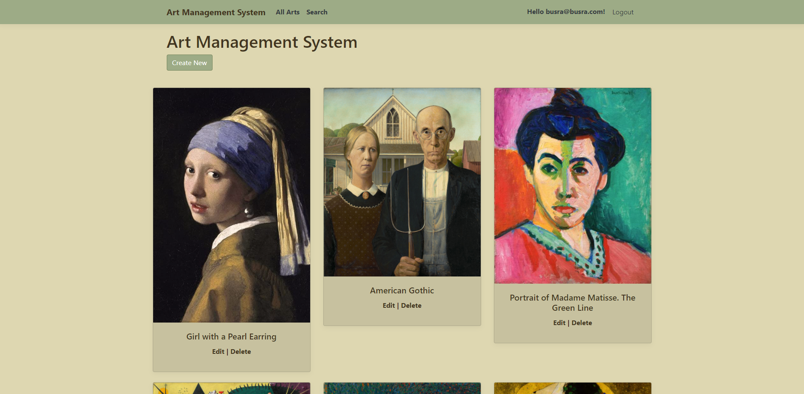

# Art Management System

**At this project i used Asp.net core mvc design type.**

### HOME PAGE

### HOME PAGE CONTINUE

### HOME PAGE CONTINUE (ENDS)

### SEARCH
**I inserted "the" to the form field**

### SEARCH RESULTS OF "THE"

### SEARCH RESULTS CONTINUE

**if you want to create, delete or edit any data you must be logged in as an user, so if you are not you will be redirected to a login page**

### LOGIN PAGE

**The data i added was ; Art name: Mono Lisa , Artis Name: Leonardo Da Vinci , Image: (the image of mona lisa)**

### CREATE PAGE

### AFTER CREATE 

**I edited the data "The Lady with an Ermine" to "The Lady with an Ermine Edited" and edited its image**

### EDIT PAGE

### EDIT PAGE RESULT

**I deleted the data "The Lady with an Ermine Edited"**

### DELETE PAGE 

### DELETE PAGE RESULT

